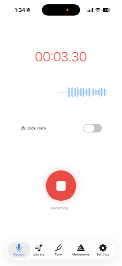
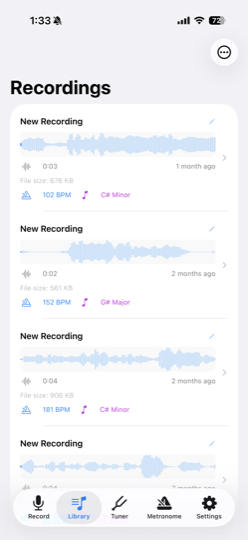
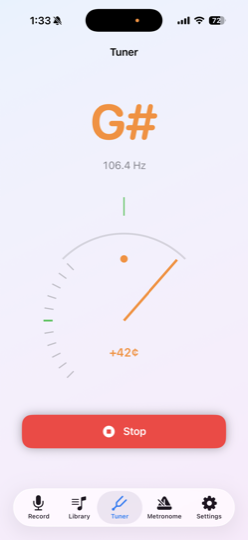
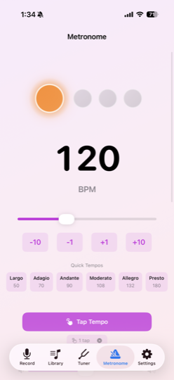

# RiffMemo

[](https://github.com/traksaw/riffMemo/actions/workflows/ios-build.yml)
[](LICENSE)


A native iOS app for musicians to capture, analyze, and organize musical ideas — inspired by Apple's discontinued Music Memos. Built with SwiftUI and AVFoundation, with an on-device audio analysis pipeline for tempo, key, and pitch detection.

## Features

- **One-tap recording** with a live waveform and frequency spectrum view
- **On-device audio analysis** — BPM detection, key detection, pitch detection, and recording quality scoring
- **Built-in metronome and tuner**
- **Library management** — search, organize, and review past recordings with waveform thumbnails
- **Export** — single and batch export with configurable options
- **iCloud sync** via SwiftData + CloudKit

## Screenshots

| Recording | Library | Tuner | Metronome |
|:---:|:---:|:---:|:---:|
|  |  |  |  |

## Engineering Highlights

- **Custom on-device DSP** — BPM, key, and pitch detection are implemented from scratch (`Audio/Analysis/`) rather than pulled from a third-party library, running entirely on-device with no network round-trip.
- **Testable audio layer** — recording, playback, and analysis live behind manager/repository interfaces, so view models are unit-tested with `XCTest` without touching AVFoundation or a simulator's microphone.
- **Clear separation of concerns** — MVVM + Coordinator throughout: views own presentation, `@Observable` view models own state, coordinators own navigation. No feature reaches into another feature's internals.
- **CI on every change** — GitHub Actions builds and runs the test suite on every push and pull request against `main`, catching regressions before merge.

## Tech Stack

- **Platform**: iOS (Swift, SwiftUI)
- **Architecture**: MVVM + Coordinator pattern
- **Audio**: AVFoundation / AVAudioEngine for recording and playback, custom DSP for BPM/key/pitch detection
- **Persistence**: SwiftData with CloudKit sync
- **CI**: GitHub Actions — automated build and test on every push/PR ([workflow](.github/workflows))
- **Testing**: XCTest (unit + UI)

## Architecture

```
RiffMemo/
├── App/                    # App entry point, root coordinator, tab navigation
├── Core/                   # Shared utilities, extensions, logging, sharing, haptics
├── Features/                # SwiftUI views + view models, one folder per feature
│   ├── Recording/          # Recording flow, live waveform, spectrum visualization
│   ├── Library/             # Browse, search, organize recordings
│   ├── Playback/            # Recording detail + playback controls
│   ├── Waveform/            # Waveform rendering and thumbnails
│   ├── Analysis/             # Analysis results UI
│   ├── Metronome/           # Metronome
│   ├── Tuner/                # Instrument tuner
│   ├── Export/               # Single + batch export
│   └── Settings/
├── Audio/                   # Audio engine layer, isolated from UI
│   ├── Recording/           # AVAudioEngine-based recording manager
│   ├── Playback/             # Playback manager
│   ├── Analysis/             # BPM, key, and pitch detectors; quality analyzer
│   ├── Metronome/            # Metronome timing engine
│   └── Export/                # Audio export engine
├── Data/
│   ├── Models/                # SwiftData models
│   ├── Repositories/          # Data access layer
│   └── Storage/               # File + persistence utilities
└── Resources/                 # Assets, localization
```

Each feature follows the same shape: a SwiftUI `View`, an `@Observable` `ViewModel` for state and business logic, and a `Coordinator` for navigation. The audio engine and data layers are isolated behind repositories/managers so the UI never talks to AVFoundation or SwiftData directly — this keeps the view models unit-testable without a simulator.

## Getting Started

### Prerequisites
- Xcode 15+
- iOS 17+ SDK
- macOS 14+ (Sonoma)
- Apple Developer account (for on-device testing)

### Setup
```bash
git clone https://github.com/traksaw/riffMemo.git
cd riffMemo/RiffMemo
open RiffMemo.xcodeproj
```
Select your development team under signing settings, then build and run. See [SETUP_GUIDE.md](SETUP_GUIDE.md) for a walkthrough and [XCODE_FIX_GUIDE.md](XCODE_FIX_GUIDE.md) for common project-setup issues.

### Running tests
```bash
cd RiffMemo
xcodebuild test -project RiffMemo.xcodeproj -scheme RiffMemo \
  -destination 'generic/platform=iOS Simulator'
```
The same build-and-test job runs in CI on every push and pull request against `main`.

## Roadmap

- [ ] Instrument detection
- [ ] Chord detection
- [ ] Multi-track recording
- [ ] Auto-accompaniment (bass/drums)
- [ ] GarageBand export

## License

MIT License. See [LICENSE](LICENSE) for details.

## Acknowledgments

Inspired by Apple's Music Memos (2016–2021).

## Contact

**Waskar Paulino**
[GitHub](https://github.com/traksaw) · [LinkedIn](https://www.linkedin.com/in/waskar-m-paulino/) · [workwithwaskar@gmail.com](mailto:workwithwaskar@gmail.com)

---

**Status**: In active development
**Started**: November 2025
